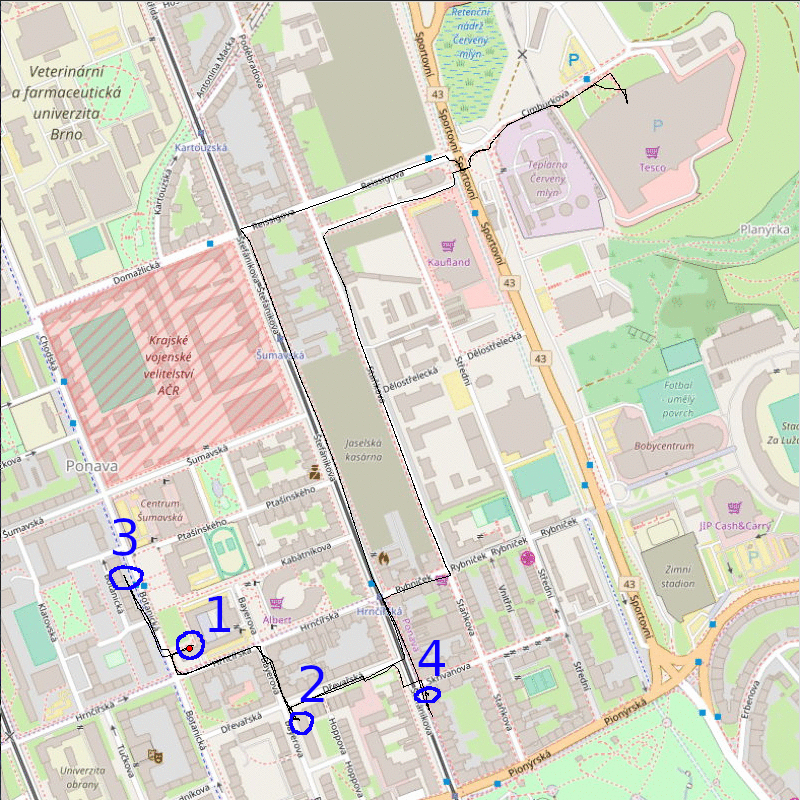

# Spy mission

## Answers to questions
1. most likely student of FI MUNI - started and finished there
2. Bayerova 36 - visited it twice, I don't see any other reason to go there
3. Could be sick, since he stopped by pharmacy on Botanická
4. Seems to have visited `Buchta B` so probably something from there

## About program
- since I wanted to use icons I had to upload `.zip` instead of just `.py`, I hope that it isn't a problem
- on startup program attempts to open file `log.txt` if such file is located in current directory
- files with GPS data can also be loaded while program is already running
- program uses `GPGGA` sentences to draw path, also is able to validate checksum of sentences

### Playback controls
| icon                              | function                                 |
|-----------------------------------|------------------------------------------|
|| play or pause playback                   |
|            | stop playback, delete lines              |
|    | increase speed                           |
|| decrease speed                           |
|          | stop playback, delete lines, go to start |
|              | stop playback, draw full path            |

- upper slider
  - shows progress
  - can be dragged to jump in playback
- speed slider
  - delay between each movement