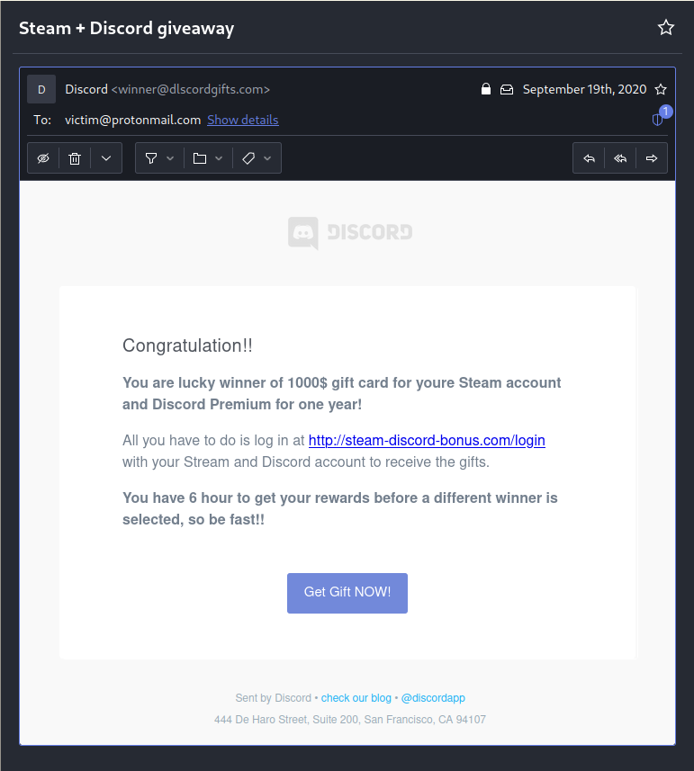

# Custom phishing mail

## Red Flags
- suspicious sender address (winner@dlscordgifts.com)
  - uses L instead of I
  - Discord does not have domain discordgifts.com
- too good to be true (1000$ and Discord Nitro for one year)
- using "Discord Premium" instead of "Discord Nitro"
- suspicious domain `http://steam-discord-bonus.com`
- urgency
  - you only have 6 hours to get gift
  - Get Gift **NOW**!
- grammatical errors and typos (Congratulation, Stream, 6 hour)
- real Discord emails usually start with `Hey [username],` but this one doesn't mention the username

